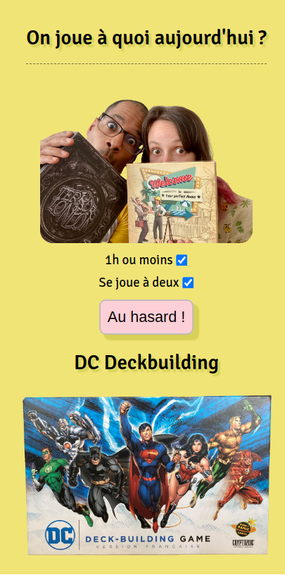

# À quoi on joue ?
* Petite app 100% front en JS vanilla, qui permet de tirer au sort un jeu auquel jouer.
* On peut réduire le tirage à deux paramètres si on le souhaite: si le jeu est jouable à deux, et si la partie dure une heure ou moins.
* Le titre s'adapte à l'heure: passé 18h, l'app demande à quoi on joue *ce soir* (et non plus "aujourd'hui").
* Enfin, l'app fetch la liste des jeux depuis un json.

